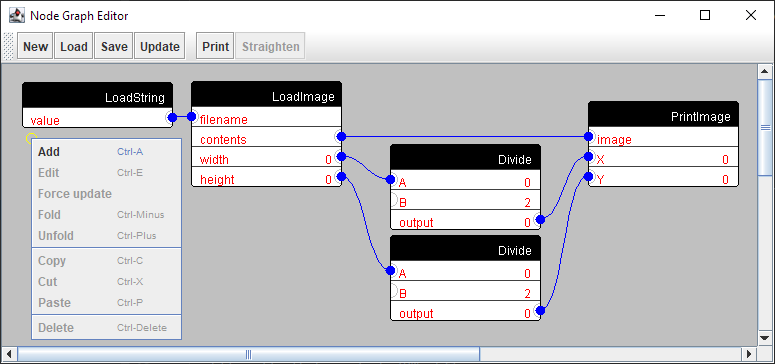

# Node Graph and Editor

A pure Java implementation of Node based [data flow programming](https://en.wikipedia.org/wiki/Dataflow_programming).

Data-flow programming is aesthetically pleasing, greatly reduces the chance of syntax error, and empowering for people
that are not fluent in the archaic syntax of text-only languages.

### Features

- Parallel operation: Nodes are not directed or forced to run.  There is little danger of large networks overflowing the stack.
- Foldable: Collapse a subgraph down to a single node with Fold and reverse with Unfold
- Convenient: Built in nodes for basic math and reporting.
- Tested: Unit tests for everything!  If it can be tested, we shall!
- A sample editor has been provided in Java Swing.  The main executable class is `com.marginallyClever.nodeGraphSwing.NodeGraphEditorPanel`.
- While running the Swing editor you can also access Swing-only nodes like `LoadImage` and `PrintImage`.  PrintImage will appear in the background of the node editor panel.

### Use it, Discuss it, Love it.

- Please see the [Javadoc with the full API for Core and Swing](https://marginallyclever.github.io/NodeGraphCore/javadoc).
- Please see guide for [how to Contribute](https://github.com/MarginallyClever/NodeGraphCore/blob/main/CONTRIBUTING.md)
- The [Official webpage](https://marginallyclever.github.io/NodeGraphCore/)!
- Join [the Discord channel](https://discord.gg/Q5TZFmB) and make new friends.

### Based on work by

- https://nodes.io/story/
- https://github.com/janbijster/cobble
- https://github.com/kenk42292/shoyu
- https://github.com/paceholder/nodeeditor
- https://github.com/miho/VWorkflows
- https://nodered.org/
- Unity
- Blender
- and others
