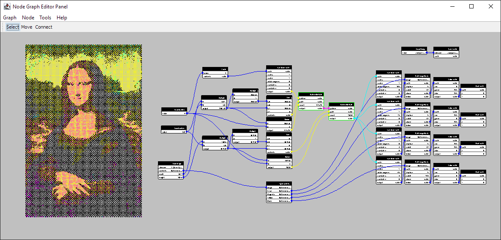

# Donatello Node Graph and Editor

A pure Java implementation of Node based [data flow programming](https://en.wikipedia.org/wiki/Dataflow_programming) and a GUI editor.

Data-flow programming is aesthetically pleasing, greatly reduces the chance of syntax error, and empowering for people
that are not fluent in the archaic syntax of text-only languages.

### Features

- Nodes are not directed or forced to run via triggers.  There is little danger of large networks overflowing the stack.  They could be run in parallel.
- Folding: Collapse a subgraph down to a single Node with *Fold* and reverse with *Unfold*
- Convenient built-in nodes for basic math and reporting.
- Unit tests for everything!  If it can be tested, we shall!
- The editor has written in Java Swing.  The main executable class is `com.marginallyclever.donatello.Donatello`.
- While running the Swing editor you can also access Swing-only nodes like `LoadImage` and `PrintImage`.  PrintImage results will appear in the background of the node editor panel.
- A ~/Donatello/ folder contains the application log file.
- A ~/Donatello/extensions/ folder contains 3rd party plugins.  Add new Nodes or write your own.

### Use it, Discuss it, Love it.

- Please see the [Javadoc with the full API for Core and Swing](https://marginallyclever.github.io/NodeGraphCore/javadoc).
- Please see guide for [how to Contribute](https://github.com/MarginallyClever/NodeGraphCore/blob/main/CONTRIBUTING.md)
- The [Official webpage](https://marginallyclever.github.io/NodeGraphCore/)!
- Join [the Discord channel](https://discord.gg/Q5TZFmB) and make new friends.

### Based on work by

- https://nodes.io/story/
- https://github.com/janbijster/cobble
- https://github.com/kenk42292/shoyu
- https://github.com/paceholder/nodeeditor
- https://github.com/miho/VWorkflows
- https://nodered.org/
- Maya
- Unity
- Blender
- and others
